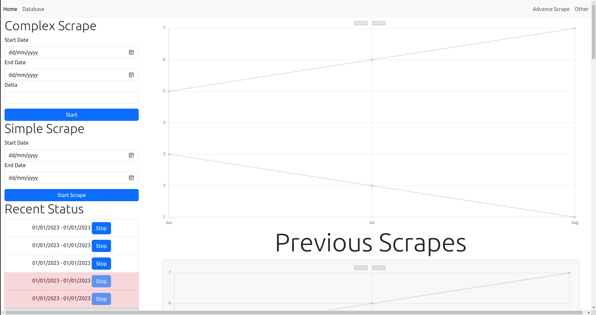

# MLS Webinterace

This is the frontend/GUI for a scraper. You could see graphs that shows data from each individual scrape. Overall, this was a fun project to work on. The frontend was built using React.JS and Chart.js. 
